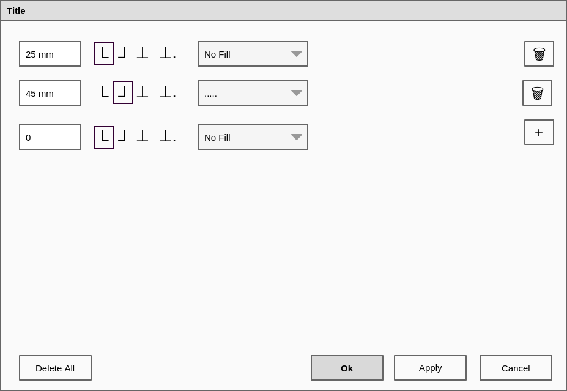

# Draft for a tabulator manager

This proposal is not finished yet.

Proposal for a new tabulator manager:

- that is easier to understand
- improves the speed for defining tabulators at specific positions.

## Current situation

- While the "In-Frame" editing, the user can easily add tabulators by clicking in the ruler at the top of the window.
- In the Text Properties, under Column & Text Distances, there is a tabulator manager that has its own small GUI. Based on some sort of ruler hich has no relationship with the width of the text in the document.
- The same pseudo ruler is used in the style manager.

The user:

- creates left aligned tabulators by clicking on the ruler and can then move them,
- converts them to other types of tabulators by right clicking on them, and
- can pull them out of the ruler to delete them.

In the tabulator manager and in the styles, the user can use the provided fields to move existing tabulators to a specific place.

## Goals of this proposal

- The visual creation of tabulators during the "In-Frame" editing is fine as is and does not need any change.
- Both the tabulator manager and the style dialog should drop the visual creation of tabulator and use a widget that is easier to understand and is geared towards adding the tabulators at exact positions.

## Compiling

- `mkdir build && cd build`
- `cmake ..`
- `make`
- `./tabulators`

## Using `.ui` files

- https://github.com/jasondegraw/Qt-CMake-HelloWorld/blob/master/CMakeLists.txt
- https://stackoverflow.com/questions/25989448/implementing-qt-project-through-cmake

## Dynamically adding widgets

Create a separate `.ui` with the line:

- <https://stackoverflow.com/questions/3492739/auto-expanding-layout-with-qt-designer>:  
  After creating your Widget in Qt Designer, right-click on the background of the widget and select "Lay out > Lay out Horizontally"  from the bottom of the context-menu.

add the child `.ui` to the main one:

- https://stackoverflow.com/questions/15204925/dynamically-adding-qwidgets-to-qvboxlayout
